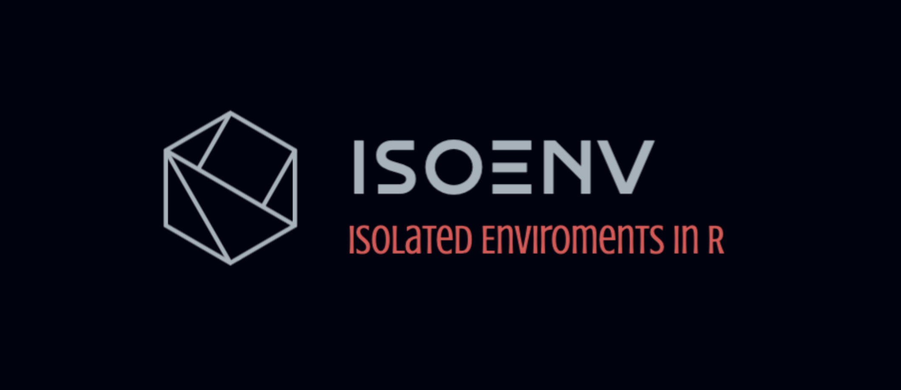

# isoENV 

### Isolated environments for R script execution & single-session, in-memory pipelines.




## Intro

The `isoENV` R package aims to provide a robust framework for executing scripts within isolated environments. This capability allows users to define specific inputs and outputs to these environments, making workflows cleaner and more robust.

In essence, this allows you to emulate a classic (bioinformatics) pipeline, with defined in- and outputs to each tool (script), ***within a single R session***. 

This is useful when with large objects (such as single-cell objects), by avoiding frequent read and write operations to disk. `isoENV` significantly reduces I/O time and enhances computational efficiency.


## Motivation

Bioinformatics workflows are traditionally split into two paradigms: the classic pipeline and the interactive session. 

The classic bioinformatics pipeline calls tools after each other with clearly defined file inputs and parameters. This can be via a mother-bash file, or pipeline managers like snakeMake or NextFlow. 

```shell
# mother.script.sh

tool1 -in=Data -p=Parameters1 -out=OutPut1
tool2 -in=OutPut1 -p=Parameters2 -out=OutPut2
tool3 -in=OutPut2 -p=Parameters3 -out=OutPut3
# ... etc
```

The other typical case is a completely funcionalized pipeline in an interactive session. `Seurat` for single-cell analysis is a typical example. It relies on each step written as a function.

```R
# interactive.analysis.R

obj <- readInput(Data)
obj <- funFilterData(obj, Parameters1)
obj <- funProcessData(obj, Parameters2)
obj <- funTransformData(obj, Parameters3)
# ... etc
```

While functionalizing each step is laudable, it often does not represent the initial stages of pipeline development, which usually involves running scripts sequentially. 

```R
#  mother.script.R

obj <- readInput(Data)
source('FilterData.R')
# `FilterData.R` uses global variables, updates obj, creates variables, etc.
source('ProcessData.R')
# `ProcessData.R` uses global variables, updates obj, creates variables, etc.
source('TransformData.R')
# ... etc
```

This approach is very easy to develop, but

1.  It can pollute the global environment & 
2.  Obscure tracking necessary variables for each particular step. 
3.  Also, consequently, resuming a pipeline from the middle becomes challenging. 

    1.  >  *Imagine `myVar` created `FilterData.R` and then used later in `TransformData.R`. You can't start a new session, load `obj` and continue.  `myVar` will be missing...*


The `isoENV` package and its `sourceClean()` function alleviate these issues by allowing a clean and controlled execution of scripts, without the need to encapsulate each analysis step within a function.


## How it works

`sourceClean()` is an enhanced alternative to the traditional `source()` function. It executes R scripts in an isolated environment (that is not a daughter of `.globalEnv`), where **<u>input variables</u>** are explicitly passed, and the scope of **<u>"input" functions</u>** can be controlled.  Users have the option to define the **<u>output variables</u>** that are returned to the global environment, promoting clarity and precision in data handling. 

`sourceClean()` ensures that all input variables are present, issuing warnings for null or undefined variables, and performs similar checks for output variables, thereby maintaining the integrity of the data analysis process.


## Limitations

Despite its advantages, `isoENV` operates within the constraints of R's environment management:

1. Interactive sessions do not allow to change the default environment, making *scoped debugging* challenging. When a script is invoked for debugging, it operates within  `.globalEnv`. This behavior is immutable within a session. While opening a new `R` session is a workaround, it necessitates writing out and reading in variables.
2. The inability to change the current or default environment in an interactive session means that variable assignments cannot simulate local environment behavior using standard syntax. For instance, assigning `A <- 2` will invariably add to  `.globalEnv` , bypassing local scopes. 

These limitation underscores the need for disciplined environment management, which `isoENV` seeks to facilitate.


## Installation

Install directly from **GitHub** via **devtools** with one R command:

```r
# install.packages("devtools"); # If you don't have it.

# Install dependencies, e.g.:
install.packages("checkmate")
devtools::install_github(repo = "vertesy/Stringendo", upgrade = F)

# Install UVI.tools
devtools::install_github(repo = "vertesy/isoENV", upgrade = F)

```

...then simply load the package:

```r
devtools::load_all("isoENV") # or:
require("isoENV")

# Alternatively, you simply source it from the web. *This way function help will not work, and you will have no local copy of the code on your hard drive.*
source("https://raw.githubusercontent.com/vertesy/UVI.tools/main/R/UVI.tools.R")
```

<br>


## Usage

```r
# 01.Global.R
devtools::load_all("~/GitHub/Packages/isoENV");

# Define some stuff
my <- NULL
x <- 4
fff <- function(x) x^3

isoENV::sourceClean(path = './02.Local.R'
             , input.variables = c('x', 'my', 'notmine')
             , output.variables = c('res','z', 'ys')
             , passAllFunctions = F
             , input.functions = "fff")

# Check
res
y # not found
z

```

The daughter script
```r
# 02.Local.R
y <- 2 * x
res <- fff(y)
cat("Result is:", res, fill = T)

z <- 33

# defines: y, z, res
# returns to .GlobalEnv: 
#   full env as `.env.02.Local.R` 
#     if sourceClean(assignEnv = TRUE)`
#   variables defined in `sourceClean(output.variables)`
```

## Function relationships
 > (of connected functions)

 ```mermaid
 flowchart LR 
  sourceClean(sourceClean) --> checkVars(checkVars)
  sourceClean(sourceClean) --> .removeBigObjsFromEnv(.removeBigObjsFromEnv)

 ```
 *created by `convert_igraph_to_mermaid()`*


## List of Functions

Updated: 2023/11/10

- ##### `sourceClean()`
Source a script with strict environment control

- ##### `checkVars()`
Check Variables in an Environment

- ##### `removeAllExceptFunctions()`
Removes all objects that are not functions from the specified environment.
